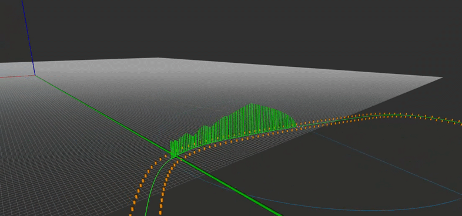

#  StudentMobilityCompetition-Planning-Control

A collection of ROS2 packages dedicated to **Path/Speed Planning and Tracking** for a custom-built EV Autonomous Vehicle.  
This repository manages my personal work for the **Planning / (High-Level)Control Team** in the Student Mobility Competition (Konkuk University - Team K.A.I.).

 **
Watch the Demo**  
- [On-road Test](https://youtube.com/shorts/4p9Xr07viQY)  
- [Debug Visualization(RViz+Plotjuggler)](https://youtu.be/WpDWq2Yr9X8) 

---

<details>
<summary><b><span style="font-size: 1.4em">📁 Project Structure</span></b></summary>


```text
Planning/
├── cone_labeling_k/ # Potential Field-based Planning
│   └── cone_labeling_k
│       ├── launch
│       │   └── cone_labeling.launch.py
│       ├── potential_field.py  # latest version(fixed several problems)
│       └── potential_field.py.BAK  # old version
│
├── cones_no_color/ # Local path generation based on traffic cones
│   ├── msg/  # custon msg that describes detected cones from Perception
│   ├── scripts/
│   │   ├── cone_safe_zone.py
│   │   ├── reference_path_planning.py
│   │   └── visualize_cones.py
│   └── launch/ …
│
├── gps_global_planner/ # Global path generation using GPS·RTK
│   ├── data/ # CSVs containing Longitude/Latitude, UTM Coordinates, Covariances
│   ├── launch/
│   │   ├── gps_global_planner_launch.py
│   ├── scripts/
│   │   ├── auto_place_cones.py
│   │   ├── cone_roi_publisher.py
│   │   ├── course_csv_creator.py
│   │   ├── global_yaw_estimator_node.py
│   │   └── publish_global_cones.py
│   └── src/
│       ├── gps_to_local_cartesian.cpp
│       ├── local_cartesian_path_publisher.cpp
│       ├── status_colored_path_publisher.cpp
│       └── vehicle_tf_broadcaster.cpp
│
├── reference_path_classifier/ # Classifies Cones into Left and Rigth Sides(Using Global Path)
│   ├── launch/
│   │   └── classify_cones_by_side.launch.py
│   ├── scripts/
│   │   └── classify_cones_by_side.py
│   └── src/
│       └── classify_cones_by_side.cpp
│
├── speed_planner/ # Calculates Desired Speed for Each Waypoints based on Curvature of the Path
│   ├── launch/
│   │   └── simple_speed_planner.launch.py
│   ├── config/
│   │   └── simple_speed_planner.yaml
│   └── src/  # Publishes speed and rpm command
│       └── simple_speed_planner.cpp
│
├── pure_pursuit/ # Path Tracking Algorithm - 3 different versions
│   ├── config/ # paremeter tuning files
│   │   ├── adaptive_pp.yaml
│   │   ├── pure_pursuit_dynamic.yaml
│   │   └── pure_pursuit_static.yaml
│   ├── launch/
│   │   ├── adaptive_pure_pursuit.launch.py
│   │   ├── pure_pursuit_dynamic.launch.py
│   │   └── pure_pursuit_static.launch.py
│   └── src/  # 3 different methods nodes
│       ├── pure_pursuit_adaptive.cpp
│       ├── pure_pursuit_dynamic.cpp
│       └── pure_pursuit_static.cpp
│
└ How To Play.txt # Contains How to Run My Packages
```

</details>

---

## Key Features

| Package | Main Functions | Language |
|--------|-----------|------|
| **cones_no_color** | • Generates an optimal reference path from cone locations<br>• Provides RViz visualization nodes | Python |
| **gps_global_planner** | • Converts RTK-GPS logs to CSV and nav_msgs/Path<br>• ENU ↔ Local Cartesian conversion<br>• Colors the global path by state and speed | C++, Python |
| **reference_path_classifier** | • Classifies cones on the left and right sides relative to the vehicle | Python |
| **pure_pursuit** | •  Tracks the local path via Pure Pursuit (static/dynamic/adaptive look-ahead)<br>• Subscribes nav_msgs/Path (/local_planned_path) and /current_speed; publishes /cmd/steer and RViz debug markers| C++ |

---

## Usage
- Refer to `How To Play.md`

### Build (ROS2 Humble)

```bash
cd [workspace path]
colcon build --symlink-install --cmake-args -DCMAKE_BUILD_TYPE=Release
source install/setup.bash
```
- Use `--symlink-install` for immediate reflection of source code changes in the install directory.
- Use `-DCMAKE_BUILD_TYPE=Release` for optimized execution performance.

### Example Execution

```bash
# 1) Generate and publish the GPS-based global path
ros2 launch gps_global_planner gps_global_planner_launch.py

# 2) Classify left-right cones using Global Planned Path
ros2 launch reference_path_classifier classify_cones_by_side.launch.py

# 3) Generate a local path based on detected cones
ros2 run cones_no_color reference_path_planning.py

# 4) Generate and publish the desired speed and RPM based on curvature of the path
ros2 launch speed_planner simple_speed_planner.launch.py

# 5) Track the local path using (Adaptive) Pure Pursuit Algorithm
ros2 launch pure_pursuit adaptive_pure_pursuit.launch.py
```

### Demo Video

<table>
  <tr>
    <td align="center">
      <br>
      <b>1. Global Path Planning</b>
    </td>
    <td align="center">
      <br>
      <b>2. Global Cones and ROI(Sim)</b>
    </td>
  </tr>
  <tr>
    <td align="center">
      <br>
      <b>3. Right/Left Classification using Frenet</b>
    </td>
    <td align="center">
      <br>
      <b>4. Delaunay Triangulation</b>
    </td>
  </tr>
  <tr>
    <td align="center">
      <br>
      <b>5. Interpolation and Sampling</b>
    </td>
    <td align="center">
      <br>
      <b>6. Obstacle Radius and Visualize Safe Zone</b>
    </td>
  </tr>
  <tr>
    <td align="center">
      <br>
      <b>7. Local Speed Planning</b>
    </td>
    <td align="center">
      <br>
      <b>8. Path Tracking(Pure Pursuit)</b>
    </td>
  </tr>
</table>

---

### Several Attempts for Better Planning and Tracking

<p align="center">
  <br>
  <span style="font-size:20px; font-weight:bold;">Adaptive Pure Pursuit</span>
</p>

<p>
  This GIF visualizes the <b>Adaptive Pure Pursuit algorithm</b>, based on the paper 
  <i>“Accurate Path Tracking by Adjusting Look-Ahead Point”</i>. The <b>look-ahead distance</b> dynamically 
  adjusts depending on vehicle speed and path curvature, enabling more accurate and stable path tracking 
  compared to standard Pure Pursuit.
</p>

<ul>
  <li><b>Pink Marker:</b> Look-Ahead Point of Adaptive Pure Pursuit</li>
<li><b>Orange Arrow:</b> Vehicle Heading Direction based on Adaptive Pure Pursuit</li>
</ul>

<p>
  In curves, the look-ahead distance is reduced to minimize path deviation, while on straights it is increased 
  for smoother tracking, improving trajectory stability under diverse driving conditions.
</p>

---

<div align="center">
  
  
  <br>
  <span style="font-size:20px; font-weight:bold;">Potential Field-Based Local Path Planning</span>
</div>

<p>

  This GIF demonstrates <b>local path planning using a Potential Field method</b>. The algorithm generates a field 
  around all detected cones and identifies the lowest "trough" line as the optimal drivable path, 
  marking these as <b>Through Points</b> (mandatory waypoints the path must pass through). 
  The selected points are then refined with <b>Centripetal Catmull–Rom Spline Interpolation</b> to generate a smooth and continuous 
  local path relative to the vehicle's <code>base_link</code> frame.
</p>


<ul>
  <li><b>Colored Grid:</b> Potential field intensity map</li>
  <li><b>Yellow Dots:</b> Trough Points before smoothing</li>
  <li><b>Pink Line:</b> Final smoothed local path</li>
  <li><b>Blue / Yellow Spheres:</b> Left and Right cones respectively</li>
</ul>

---


<div align="center">
  
  <br>
  <span style="font-size:20px; font-weight:bold;">Greedy Graph-Guided Local Path Planning</span>
</div>

<p>

  This GIF demonstrates <b>local path planning using a Greedy, graph-guided centerline search</b>. The pipeline
  reconstructs left/right boundary lines from color-labeled cones, generates robust midpoints
  (Hungarian / projection / resample-align), and then selects a forward-feasible center path on a radius graph by
  minimizing distance with <b>boundary</b>, <b>directional</b>, and <b>smoothness</b> penalties under heading-change gates.
  The result is resampled and <b>anchored to the vehicle's <code>base_link</code> frame</b>, then published as <code>nav_msgs/Path</code>.
</p>

<ul>
  <li><b>Left/Right Lines:</b> Reconstructed track boundaries from cones</li>
  <li><b>Green Dots:</b> Midpoints between boundaries</li>
  <li><b>Green Line:</b> Final fixed-length local center path</li>
  <li><b>Blue / Yellow Spheres:</b> Left and Right cones respectively</li>
  
</ul>


---

## Development Environment

| Item            | Version / Tool               |
|-----------------|------------------------|
| OS              | Ubuntu 22.04           |
| ROS             | ROS2 Humble            |
| GPS RTK Module            | ZED-F9P-04B-01            |
| IMU Module            | myAHRS+            |
| Languages            | Python 3.10 / C++17    |

---

## References

- [ROS2 Official Documentation](https://docs.ros.org/en/humble/)
- [MathWorks Blog: Path Planning for Formula Student Driverless Cars](https://blogs.mathworks.com/student-lounge/2022/10/03/path-planning-for-formula-student-driverless-cars-using-delaunay-triangulation/?from=kr)
- [u-blox GitHub - RTKLIB, GNSS tools](https://github.com/u-blox)
- [u-blox F9P Interface Description (Documentation)](https://content.u-blox.com/sites/default/files/documents/u-blox-F9-HPG-1.32_InterfaceDescription_UBX-22008968.pdf)
- [Accurate Path Tracking by Adjusting Look Ahead Point in Pure Pursuit Method](https://www.youtube.com/watch?v=1nRdlEsYopY)
---

## Contributions & Contact

- imhyeonwoo21@gmail.com
- imhyeonwoo21@konkuk.ac.kr
- https://www.youtube.com/@hwi4201

- I can send you bag files I used if you want
